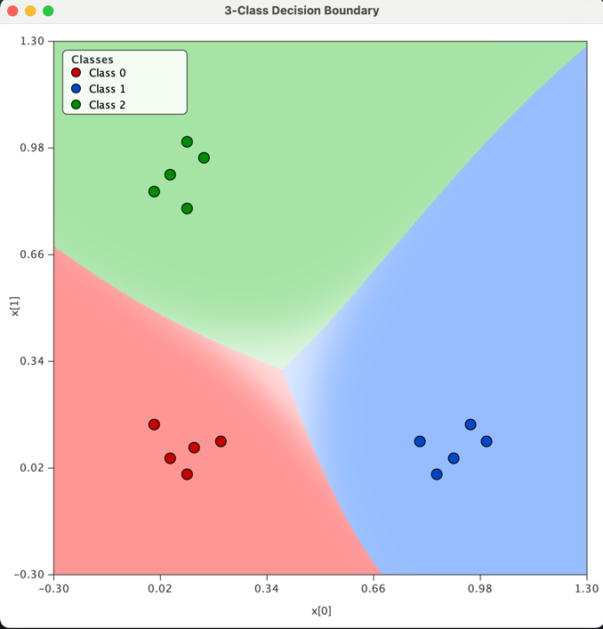
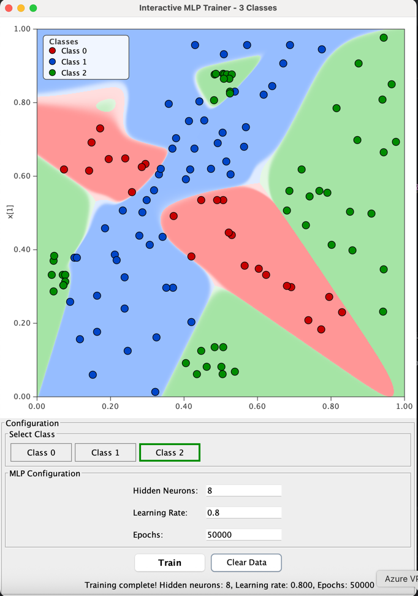
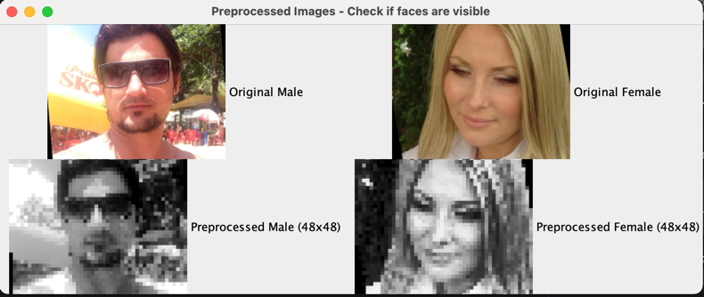

# Fundamentals of Neural Networks (ANN's and CNN's) by Example

This project implements fundamental neural network concepts from scratch in Java, recapping backpropagation, gradient descent, and multilayer perceptrons or feed forward networks (MLPs resp. FFN's)
that I mostly covered back in my studies and time affiliated with the Institute of Neuroinformatics at ETH Zürich.

The simplest one demonstrates backpropagation and gradient descent basics for an MLP (Multi-Layer Perceptron), first applied to the classic XOR problem and then a more complex 3-class classification task.
Finally, the same ANN implementation is then applied to a more realistic "real-world" computer vision problem: classifying gender from facial photos.

Everything's written in plain Java with visualizations —at least for the 2D cases like XOR and 3-class. **It's built for learning, experimenting, and really getting how neural nets work under the hood**.

No external libs except for the final CNN version using [Deeplearning4j](https://deeplearning4j.konduit.ai/deeplearning4j/reference/multi-layer-network), which tackles the same gender classification task.

---

## Feedforward Neural network or simply ANN (Artificial Neural Network)


### The `ANN` class

The `ANN` class implements:

- One **input layer**
- One **hidden layer**
- One **output layer**
- **Sigmoid** activation functions
- **Backpropagation** learning
- **Stochastic Gradient Descent (SGD)**
- **Mean Squared Error (MSE)** loss

### Network Structure

The network structure is defined when creating an instance:
```java
ANN ann = new ANN(inputs, hiddenNeurons, outputs);
```

Meaning:

- `inputs` → number of values in one input sample
- `hiddenNeurons` → number of neurons in the hidden layer
- `outputs` → number of values produced by the network

Example:
```java
ANN ann = new ANN(2, 3, 1);
```

### Core Methods

```java
void train(double[][] X, double[][] Y, int epochs, double learningRate);
```

Trains the network using supervised learning via backpropagation that minimizes Mean Squared Error (MSE)


```java
double[] apply(double[] input);
```

Runs a **forward pass** through the network.

- Computes hidden layer activations
- Computes output layer activations
- Returns the network output

---

## Example: XOR Problem

The XOR problem is a classic neural network example:

| Input | Output |
|------|--------|
| 0, 0 | 0 |
| 0, 1 | 1 |
| 1, 0 | 1 |
| 1, 1 | 0 |

This problem **cannot be solved with a single linear layer**, which makes it a perfect test for a neural network with a hidden layer.

### Example usage
```java
double[][] X = {
    {0, 0},
    {0, 1},
    {1, 0},
    {1, 1}
};

double[][] Y = {
    {0},
    {1},
    {1},
    {0}
};

ANN ann = new ANN(2, 3, 1);
ann.train(X, Y, 50_000, 0.5);

for (double[] x : X) {
    double[] out = ann.apply(x);
    System.out.println(
        "(" + (int)x[0] + ", " + (int)x[1] + ") -> " + out[0]
    );
}
```

```
Example output after 50,000 epochs:
Input (0, 0) -> 0.0066
Input (0, 1) -> 0.9930
Input (1, 0) -> 0.9930
Input (1, 1) -> 0.0059
Final MSE = 4.3883104584561E-5

So the network correctly classified all 4 samples on a non-linear decision boundary!
```

### XOR Problem - Decision Boundary


---


### 3 Class Problem Example

The 3-class problem extends binary classification to **multi-class classification**, demonstrating how neural networks can learn to separate data into three distinct regions. This is a fundamental step beyond the XOR problem, showing how networks handle more complex decision boundaries.

#### Problem Description

Three classes are arranged in distinct regions of the 2D input space:
- **Class 0**: Points near (0, 0) - bottom-left corner
- **Class 1**: Points near (1, 0) - bottom-right corner  
- **Class 2**: Points near (0, 1) - top-left corner

The network must learn to create **non-linear decision boundaries** that separate these three regions.

#### Example Usage

```java
// Create network: 2 inputs, 6 hidden neurons, 3 outputs (one per class)
ANN ann = new ANN(2, 6, 3, 0.3, 42);

// Training data: 15 samples (5 per class)
double[][] X = {
    // Class 0 region (near 0,0)
    {0.05, 0.05}, {0.10, 0.00}, {0.00, 0.15}, {0.12, 0.08}, {0.20, 0.10},
    
    // Class 1 region (near 1,0)
    {0.90, 0.05}, {1.00, 0.10}, {0.85, 0.00}, {0.95, 0.15}, {0.80, 0.10},
    
    // Class 2 region (near 0,1)
    {0.05, 0.90}, {0.10, 1.00}, {0.00, 0.85}, {0.15, 0.95}, {0.10, 0.80},
};

// One-hot encoded labels: [1,0,0] for Class 0, [0,1,0] for Class 1, [0,0,1] for Class 2
double[][] Y = {
    {1, 0, 0}, {1, 0, 0}, {1, 0, 0}, {1, 0, 0}, {1, 0, 0},  // Class 0
    {0, 1, 0}, {0, 1, 0}, {0, 1, 0}, {0, 1, 0}, {0, 1, 0},  // Class 1
    {0, 0, 1}, {0, 0, 1}, {0, 0, 1}, {0, 0, 1}, {0, 0, 1},  // Class 2
};

// Train the network
ann.train(X, Y, 500_000, 0.3);

// Test predictions
double[] out = ann.apply(new double[]{0.08, 0.10});  // Should predict Class 0
int predictedClass = argMax(out);  // Returns index of highest output
```

#### Key Concepts

**One-Hot Encoding**: Each class is represented as a binary vector where exactly one element is 1:
- Class 0 → `[1, 0, 0]`
- Class 1 → `[0, 1, 0]`
- Class 2 → `[0, 0, 1]`

**Multi-Class Classification**: The network outputs 3 values (one per class), and the class with the highest output is the prediction.

**Decision Boundaries**: The network learns to create curved boundaries that separate the three regions, demonstrating its ability to handle non-linear, multi-class problems.

### 3 Class Problem - Decision Boundary


The visualization shows three distinct regions (red, blue, green) separated by smooth decision boundaries. The network successfully learns to classify points into the correct regions based on their position in the 2D space.

### The same 3 Class Problem that demonstrates model overfitting


This example demonstrates **overfitting** - when a model memorizes the training data instead of learning the general pattern. Notice how the decision boundaries are jagged and irregular, creating small "islands" around individual training points.

#### What Causes Overfitting?

1. **Too Few Training Samples**: Only 13 samples total (vs. 15 in the normal example)
2. **Contradictory Labels**: Points are intentionally mislabeled for their location:
   - A point near (0,0) labeled as Class 1
   - A point near (1,0) labeled as Class 2
   - A point near (0,1) labeled as Class 0
3. **Outliers**: A central point (0.45, 0.45) forces the boundary to bend unnaturally

#### The Problem

The network has enough capacity (6 hidden neurons) to memorize these contradictions, but this creates boundaries that won't generalize to new data. The model "overfits" to the specific training points rather than learning the underlying pattern that Class 0 is near (0,0), Class 1 is near (1,0), and Class 2 is near (0,1).

#### How to Prevent Overfitting

- **More Training Data**: Increase the number of samples per class
- **Remove Contradictions**: Ensure labels match the data distribution
- **Regularization**: Reduce model complexity or add constraints
- **Early Stopping**: Stop training before the model memorizes noise
- **Validation Set**: Monitor performance on unseen data

This visualization clearly shows the difference between a well-generalized model (smooth boundaries) and an overfitted model (jagged, irregular boundaries).

---

## Interactive 3 Class Problem

The **InteractiveMLPTrainer** provides a graphical user interface for interactively creating training datasets, configuring MLP parameters, and visualizing decision boundaries in real-time. This tool makes it easy to experiment with different data distributions and network architectures.



### Features

- **Interactive Data Point Addition**: Click anywhere on the 2D plot to add training data points
- **Class Selection**: Choose from 3 classes (Class 0, Class 1, Class 2) with color-coded buttons
- **MLP Configuration**: Adjust network parameters:
  - **Hidden Neurons**: Number of neurons in the hidden layer
  - **Learning Rate**: Training step size
  - **Epochs**: Number of training iterations
- **Real-time Visualization**: See decision boundaries update immediately after training
- **Clear Data**: Reset the dataset to start fresh

### Howto

1. **Select a Class**: Click one of the three class buttons (Class 0, Class 1, or Class 2) to choose which class you're adding points for
   - Selected class button shows a colored border matching the class color
   - Class 0: Red
   - Class 1: Blue
   - Class 2: Green

2. **Add Training Data**: Click anywhere on the 2D plot to add data points
   - Points appear immediately with their class color
   - Status bar shows the coordinates and total point count

3. **Configure MLP**: Set your desired network parameters
   - **Hidden Neurons**: Typically 4-10 for simple problems, more for complex boundaries
   - **Learning Rate**: Start with 0.1-0.5, adjust if training is too slow or unstable
   - **Epochs**: 10,000-100,000 depending on problem complexity

4. **Train Network**: Click the "Train" button to train the MLP
   - Training runs in a background thread (UI remains responsive)
   - Decision boundaries are visualized with color-coded regions
   - Each region's opacity indicates prediction confidence

5. **Experiment**: Try different configurations to see how they affect the decision boundary
   - More hidden neurons = more complex boundaries
   - Higher learning rate = faster training but may overshoot
   - More epochs = better convergence (up to a point)

---

## Real-World Application: Gender Classification from Face Images (Using my ANN Implementation)

The **GenderClassifier** demonstrates the neural network applied to a practical computer vision task: classifying gender from facial photographs.

### Overview

- **Task**: Binary classification (Male vs Female)
- **Input**: 48×48 grayscale face images (2,304 pixels)
- **Output**: Probability of being female (0.0 = male, 1.0 = female)
- **Architecture**: 2,304 → 32 → 1
- **Performance**: ~80% test accuracy on Adience dataset

### Network Architecture
```java
GenderClassifier classifier = new GenderClassifier(
    hiddenNeurons: 32,
    learningRate: 0.05,
    seed: 42
);
```

The network processes each image as follows:
1. **Preprocessing**: Resize to 48×48, convert to grayscale, normalize pixels to [0,1]
2. **Forward pass**: 2,304 input neurons → 32 hidden neurons → 1 output neuron
3. **Classification**: Output > 0.5 = Female, Output ≤ 0.5 = Male

Shows how images are preprocessed (before and after resizing and converting)

### Dataset Preparation

The classifier uses the **Adience Benchmark Gender and Age Classification** dataset from Kaggle:

https://www.kaggle.com/datasets/ttungl/adience-benchmark-gender-and-age-classification/data

#### Step 1: Download and Extract Dataset

1. Download the dataset from Kaggle
2. Unzip to the project root directory
3. Run the Python script `copyImages.py` to extract images:
```python
# Edit the script to select the desired fold
df = pd.read_csv('AdienceBenchmarkGenderAndAgeClassification/fold_0_data.txt', sep='\t')
```

This copies images to: `src/main/resources/faces_dataset/`

#### Step 2: Crop and Prepare Images

Many images contain backgrounds or multiple faces. The `FaceCropTool` (located in the `tools` package) preprocesses images:
```java
// Runs center-crop on all images and resizes to 48×48
FaceCropTool.main(args);
```

This creates the cleaned dataset at: `src/main/resources/faces_dataset_cropped/`

### Training the Model
```java
// Load preprocessed dataset
Dataset data = GenderClassifier.loadDataset("src/main/resources/faces_dataset_cropped");

// Split into train/test
Dataset[] split = GenderClassifier.trainTestSplit(data, 0.8);

// Train with early stopping
classifier.train(trainData.X, trainData.Y, epochs);
```

### Key Training Features

**Early Stopping**: Training automatically stops when test accuracy stops improving for 100 consecutive epochs, preventing overfitting.

Example output:
```
Epoch   50: Train=88.4% Test=82.1% MSE=0.0953 (Best: 82.1% @ epoch 50)
Epoch  100: Train=93.9% Test=83.7% MSE=0.0546 (Best: 83.7% @ epoch 98)
Epoch  150: Train=96.5% Test=83.2% MSE=0.0345 (Best: 83.7% @ epoch 98)

Early stopping at epoch 198 (no improvement for 100 epochs)
⚠️  Best model was at epoch 98 with 83.7% test accuracy
```

**Important**: The "Best" accuracy shown during training is the true model performance, not the final accuracy (which may be lower due to overfitting).

### Performance Characteristics

| Dataset Size | Hidden Neurons | Parameters | Test Accuracy | Training Time* |
|-------------|----------------|------------|---------------|----------------|
| 961 images  | 16             | 36,897     | ~70-75%       | ~2 min         |
| 4,091 images| 32             | 73,793     | ~80-83%       | ~5 min         |

*Approximate, varies by hardware

### Critical Design Decisions

**Why 48×48 resolution?**
- Balance between detail and computational efficiency
- 2,304 features vs 150,528 for 224×224 images
- Sufficient for facial features (eyes, nose, mouth, hair)

**Why only 32 hidden neurons?**
- Parameter-to-sample ratio should be < 25 for good generalization
- 73,793 parameters ÷ 3,272 training samples = 22.5 ratio
- Prevents overfitting on limited dataset

**Why MSE instead of Cross-Entropy?**
- Both work for binary classification
- MSE with sigmoid is mathematically equivalent after gradient cancellation
- Simpler to implement and understand

### Limitations

- **Simple architecture**: Fully-connected networks don't capture spatial patterns like CNNs
- **Small dataset**: Professional systems use 100,000+ images
- **No data augmentation**: Could improve accuracy by 5-10%
- **Single face assumption**: Doesn't handle multiple faces or face detection
- **Limited preprocessing**: No face alignment or landmark detection

### Expected Accuracy Ranges

| Accuracy | Interpretation |
|----------|---------------|
| 50-60%   | Network not learning (random guessing) |
| 60-70%   | Learning but dataset issues (babies, multiple faces) |
| 70-80%   | Good performance for a simple MLP |
| 80-85%   | Excellent for fully-connected network |
| 85-90%   | Requires CNNs or much larger dataset |
| 90-95%   | State-of-the-art (deep CNNs on massive datasets) |

---


## Real-World Application: Gender Classification from Face Images - CNN Variant

In addition to the from-scratch MLP implementation, this project includes a **Convolutional Neural Network (CNN)** version using **Deeplearning4j** to demonstrate the performance difference between traditional fully-connected networks and modern CNN architectures.

### Implementation: GenderClassifierCNN

**Library**: [Deeplearning4j](https://deeplearning4j.konduit.ai/deeplearning4j/reference/multi-layer-network) - A deep learning library for the JVM

**Architecture**:
```
Input: 48×48×1 grayscale
  ↓
Conv2D: 16 filters (3×3) + ReLU
  ↓
MaxPooling: 2×2
  ↓
Conv2D: 32 filters (3×3) + ReLU
  ↓
MaxPooling: 2×2
  ↓
Dense: 64 neurons + ReLU
  ↓
Output: 1 neuron (Sigmoid)

Total Parameters: ~210,000
```

### Performance Comparison

| Metric | MLP (From Scratch) | CNN (Deeplearning4j) |
|--------|-------------------|---------------------|
| **Test Accuracy** | 78% | **82%** |
| **Training Time** | ~5 minutes | ~30 minutes |
| **Parameters** | 73,793 | 209,729 |
| **Complexity** | Simple | Complex |

### Key Differences

**MLP treats each pixel independently**:
- No spatial awareness
- Good for learning basic patterns
- Fast to train
- Educational implementation

**CNN learns spatial features**:
- Recognizes edges, textures, facial structures
- Better generalization to new faces
- Slower but more accurate
- Production-ready via library

### Maven Dependencies
```xml
<properties>
    <dl4j.version>1.0.0-M2.1</dl4j.version>
</properties>

<dependencies>
    <dependency>
        <groupId>org.deeplearning4j</groupId>
        <artifactId>deeplearning4j-core</artifactId>
        <version>${dl4j.version}</version>
    </dependency>
    <dependency>
        <groupId>org.nd4j</groupId>
        <artifactId>nd4j-native</artifactId>
        <version>${dl4j.version}</version>
    </dependency>
</dependencies>
```

### Usage
```java
// Same dataset preparation as MLP version
Dataset data = GenderClassifierCNN.loadDataset("src/main/resources/faces_dataset_cropped");
Dataset[] split = GenderClassifierCNN.trainTestSplit(data, 0.8);

// Create and train CNN
GenderClassifierCNN cnn = new GenderClassifierCNN();
cnn.train(trainData.features, trainData.labels, epochs: 100, batchSize: 32);

// Evaluate
double accuracy = cnn.accuracy(testData.features, testData.labels);
// Expected: ~82% test accuracy
```

### Why CNNs Perform Better

1. **Spatial locality** - Nearby pixels are processed together (e.g., both eyes, nose-mouth relationship)
2. **Translation invariance** - Face can be slightly shifted and still recognized
3. **Feature hierarchy** - Lower layers detect edges, higher layers detect facial features
4. **Parameter sharing** - Same filter applied across entire image (fewer parameters than MLP for same capacity)

### When to Use Each Approach

**Use the MLP** for:
- Understanding neural network fundamentals
- Educational purposes
- Quick prototyping
- Limited computational resources

**Use the CNN** for:
- Best accuracy on image tasks
- Production deployments
- When training time is not critical
- Modern deep learning workflows

The **4% accuracy improvement** (78% → 82%) demonstrates why CNNs became the standard for computer vision tasks, while the MLP implementation provides valuable insight into how neural networks actually work under the hood.


## Disclaimer

This project is intended for **educational purposes only**.

---

