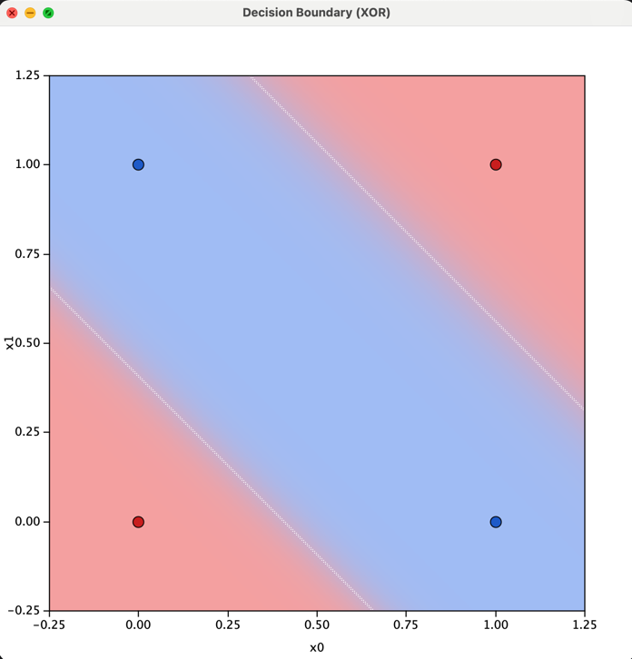
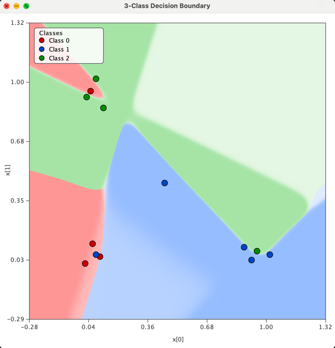

# Simple Java ANN (Multi-Layer Perceptron)

This project contains a **small, self-contained implementation of a neural network**
(also called a **Multi-Layer Perceptron**, MLP) written in plain Java.

It is designed for **learning, experimenting, and understanding how neural networks work internally**.

No external libraries are used.

---

## What is implemented?

The `ANN` class implements:

- One **input layer**
- One **hidden layer**
- One **output layer**
- **Sigmoid** activation functions
- **Backpropagation** learning
- **Stochastic Gradient Descent (SGD)**
- **Mean Squared Error (MSE)** loss

---

## Network Structure

The network structure is defined when creating an instance:

```java
ANN ann = new ANN(inputs, hiddenNeurons, outputs);
```

Meaning:

- `inputs` → number of values in one input sample
- `hiddenNeurons` → number of neurons in the hidden layer
- `outputs` → number of values produced by the network

Example:

```java
ANN ann = new ANN(2, 3, 1);
```

---

## Core Methods

### `double[] apply(double[] input)`

Runs a **forward pass** through the network.

- Computes hidden layer activations
- Computes output layer activations
- Returns the network output

---

### `void train(double[][] X, double[][] Y, int epochs, double learningRate)`

Trains the network using supervised learning via backpropagation.

---

## Example: XOR Problem

The XOR problem is a classic neural network example:

| Input | Output |
|------|--------|
| 0, 0 | 0 |
| 0, 1 | 1 |
| 1, 0 | 1 |
| 1, 1 | 0 |

This problem **cannot be solved with a single linear layer**, which makes it a perfect test for a neural network with a hidden layer.

### Example usage

```java
    double[][] X = {
        {0, 0},
        {0, 1},
        {1, 0},
        {1, 1}
    };
    
    double[][] Y = {
        {0},
        {1},
        {1},
        {0}
    };
    
    ANN ann = new ANN(2, 3, 1);
    ann.train(X, Y, 50_000, 0.5);
    
    for (double[] x : X) {
        double[] out = ann.apply(x);
        System.out.println(
            "(" + (int)x[0] + ", " + (int)x[1] + ") -> " + out[0]
        );
    }
```

---

## Disclaimer

This project is intended for **educational purposes only**.


## XOR Problem - Decision Boundry...


## 3 Class Problem - Decision Boundry...


## Again the 3 Class Problem with model overfitting....


